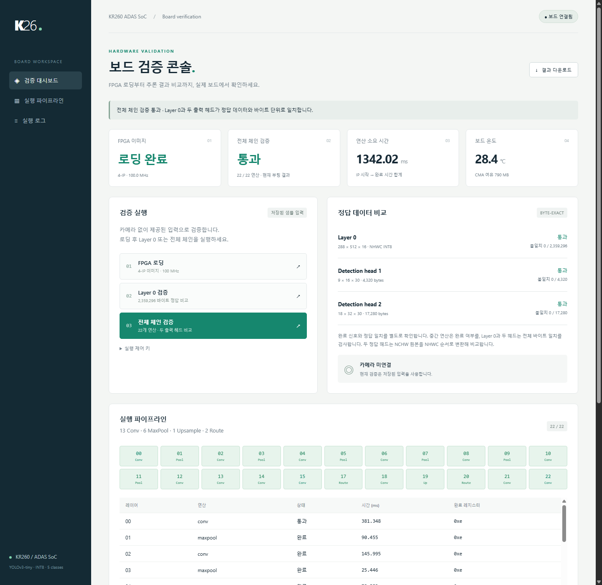
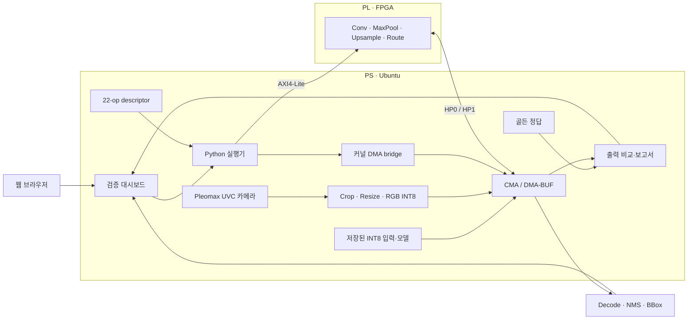

# KR260 ADAS SoC

AMD Kria KR260에서 YOLOv3-tiny INT8 네트워크를 실행하고, FPGA 상태와 추론 정확도를 웹 UI로 확인하는 PS–PL 통합 프로젝트입니다.

> **실보드 검증 완료 — 2026-09-11**
> 100 MHz에서 22개 하드웨어 연산이 모두 완료됐습니다. Layer 0과 두 detection head는 골든 데이터와 바이트 단위로 일치했습니다.



## 프로젝트 소개

이 프로젝트는 ADAS 객체 검출 모델의 정수 연산을 FPGA에서 실행하기 위한 하드웨어 export, HLS IP, Linux 실행기, 골든 모델 및 검증 자료를 묶어 제공합니다.

| 항목 | 내용 |
| --- | --- |
| 대상 보드 | AMD Kria KR260 |
| 모델 | YOLOv3-tiny, INT8 |
| 입력 크기 | RGB 512 × 288 |
| 클래스 | `car`, `person`, `sign_warning`, `sign_prohibition`, `sign_mandatory` |
| PL 연산 | Conv 13회, MaxPool 6회, Upsample 1회, Route 2회 |
| PS 환경 | Ubuntu, Python 3, Linux DMA-BUF bridge |
| 제어 방식 | AXI4-Lite MMIO 및 AP_DONE polling |
| 결과 확인 | 웹 UI, JSON 보고서, 실제 출력 바이너리 |

주요 기능은 다음과 같습니다.

- bitstream 로딩 및 PS–PL 버스 폭·클록 설정
- HWH, 22-op descriptor, 제어 레지스터 주소 교차 확인
- CMA 버퍼 할당, DMA-BUF 매핑 및 cache 동기화
- 연산별 완료 상태와 실행 시간 기록
- Layer 0과 두 detection head의 byte-exact 비교
- 웹 UI에서 재실행, 로그 조회 및 결과 다운로드
- Pleomax UVC 카메라 전처리, FPGA 실시간 반복 실행, YOLO decode/NMS와 검출 상자 표시

## 시스템 구성



현재 Linux 실행기는 4-IP `system_bringup_wrapper`를 사용합니다. 함께 포함된 `sys5_wrapper`는 별도 Layer-0 엔진을 가진 5-IP export이며 현재 웹 UI의 로딩 대상이 아닙니다.

FPGA는 정수 네트워크 연산과 raw detection head 생성까지 담당합니다. 실행기는 Pleomax UVC 카메라의 640×480 프레임을 중앙 640×360으로 자르고 512×288로 변환한 뒤 signed INT8 CMA DMA 입력으로 전달합니다. 두 raw head는 CPU에서 YOLO decode와 class별 NMS를 거쳐 웹 UI의 검출 상자로 표시됩니다.

## 실보드 검증 결과

Ubuntu 24.04.2 LTS, kernel `6.8.0-1015-xilinx` 환경에서 웹 UI로 FPGA를 로딩하고 전체 체인을 실행했습니다.

| 검증 항목 | 실측 결과 |
| --- | --- |
| FPGA 로딩 | 성공, 실제 클록 99,999,999 Hz |
| 하드웨어 연산 | 22 / 22 완료 |
| Layer 0 | 2,359,296 bytes, 불일치 **0** |
| Detection head 1 | 4,320 bytes, 불일치 **0** |
| Detection head 2 | 17,280 bytes, 불일치 **0** |
| IP 연산 시간 합계 | **1,342.020 ms** |
| 버퍼 준비·비교 포함 시간 | **3,281.149 ms** |
| 카메라 단독 캡처 | **27.61 fps** 기준값, 재측정 24.10 fps |
| 카메라 + FPGA 전체 추론 | **0.739 fps**, 1,352.92 ms/프레임 |

연산 시간은 각 IP의 시작부터 완료까지 측정한 합계이며 Python polling 지연을 포함합니다. 단일 저장 샘플 측정값이므로 카메라 FPS나 전체 앱 성능을 뜻하지 않습니다. 중간 출력 19개의 개별 정답 비교는 수행하지 않았습니다.

[검증 결과 설명](10_verification_reports/board_2026-09-11/README.md) · [실측 JSON 보고서](10_verification_reports/board_2026-09-11/verification.json) · [카메라 통합 결과](10_verification_reports/board_2026-09-11/camera-verification.json)

## 저장소 구조

| 경로 | 내용 |
| --- | --- |
| [`01_hardware_exports/`](01_hardware_exports/) | XSA, bitstream, HWH, 구현 보고서와 UART/IRQ 자료 |
| [`02_register_map/`](02_register_map/) | HLS IP 제어 레지스터 헤더와 생성 드라이버 |
| [`03_runtime_descriptor/`](03_runtime_descriptor/) | 22개 연산 순서, 버퍼 연결 및 양자화 설정 |
| [`04_layer0_contract/`](04_layer0_contract/) | Layer 0 입력, 가중치, bias, 정답 출력 |
| [`05_golden_heads/`](05_golden_heads/) | 두 detection head 정답 파일 |
| [`06_hls_sources/`](06_hls_sources/) | HLS 연산 IP 소스와 테스트 자료 |
| [`07_hls_ip_zips/`](07_hls_ip_zips/) | Vivado용 패키징 HLS IP |
| [`08_golden_model/`](08_golden_model/) | Python 골든 모델과 INT8 모델 파일 |
| [`09_docs/`](09_docs/) | 설계 및 PS 자원 요구 문서 |
| [`10_verification_reports/`](10_verification_reports/) | HLS 검증 자료와 실보드 결과 |
| [`11_board_app/`](11_board_app/) | Linux 실행기, DMA bridge, 웹 UI, 서비스 설정 |

보드에서 바로 실행할 때는 `11_board_app`을 사용합니다. HLS 소스의 `network_run_full.c`는 Vitis bare-metal 참고 코드이며 Ubuntu 실행 프로그램이 아닙니다.

## 준비 사항

- KR260 보드와 Ubuntu 이미지
- 전원 및 유선 네트워크
- 보드에 SSH로 접속할 수 있는 PC
- 보드의 관리자 권한
- 실행 커널과 일치하는 kernel headers
- FPGA Manager/configfs overlay, Xilinx AFI/fabric clock, CMA DMA heap을 지원하는 커널

검증한 보드는 800 MiB CMA를 사용했습니다. descriptor상 전체 버퍼 요구량은 약 30 MB이고 가장 큰 단일 scratch 버퍼는 약 14.2 MB입니다.

```bash
uname -r
ls /sys/class/fpga_manager/fpga0
ls /sys/kernel/config/device-tree/overlays
ls /dev/dma_heap/reserved
grep -E 'CmaTotal|CmaFree' /proc/meminfo
```

저장 샘플 검증에는 카메라, PyTorch, PYNQ, Vivado/Vitis가 필요하지 않습니다. HLS 재합성이나 하드웨어 설계 변경에는 별도 개발 도구가 필요합니다.

## 설치 및 실행

아래 명령은 KR260 Ubuntu 터미널에서 실행합니다. `<KR260_IP>`는 자신의 보드 IP로 바꾸세요.

### 1. 프로젝트 받기

```bash
ssh ubuntu@<KR260_IP>

sudo apt-get update
sudo apt-get install -y git python3 python3-opencv gcc make libc6-dev \
  device-tree-compiler linux-headers-$(uname -r)

cd /home/ubuntu
git clone https://github.com/hangyeoli/adas_soc.git KR260_ADAS_SoC
cd KR260_ADAS_SoC
```

이미 프로젝트를 복사했다면 clone 단계는 생략합니다. systemd 서비스는 `/home/ubuntu/KR260_ADAS_SoC`를 사용합니다. 다른 경로에서는 [`kr260-adas-ui.service`](11_board_app/kr260-adas-ui.service)의 `WorkingDirectory`와 `ExecStart`를 수정하세요.

### 2. DMA bridge 설치

```bash
make -C 11_board_app/dma_bridge
sudo install -D -m 644 \
  11_board_app/dma_bridge/kr260_dma.ko \
  /lib/modules/$(uname -r)/extra/kr260_dma.ko
sudo depmod -a
sudo modprobe kr260_dma
ls -l /dev/kr260_dma
```

DMA bridge는 CMA DMA-BUF를 커널 DMA API로 매핑하고 FPGA에 전달할 주소와 크기를 제공합니다. 커널이 변경되면 다시 빌드·설치해야 합니다.

### 3. 웹 UI 서비스 시작

```bash
sudo cp 11_board_app/kr260-adas-ui.service /etc/systemd/system/
sudo systemctl daemon-reload
sudo systemctl enable --now kr260-adas-ui
sudo systemctl status kr260-adas-ui --no-pager
```

같은 네트워크의 브라우저에서 다음 주소를 엽니다.

```text
http://<KR260_IP>:8080
```

서비스는 재부팅 후 UI만 자동 시작합니다. FPGA 이미지는 자동 로딩하지 않으므로 재부팅 후 UI에서 먼저 로딩해야 합니다.

## 웹 UI 사용법

상태와 결과는 바로 볼 수 있습니다. 실행 버튼을 사용하려면 최초 실행 시 생성된 제어 키를 확인합니다.

```bash
cd /home/ubuntu/KR260_ADAS_SoC
sudo cat 11_board_app/.control-token
```

UI의 **실행 제어 키**에 입력하고 저장하세요. 이 키는 SSH 비밀번호와 별개이며 Git에서 제외됩니다. README나 이슈에 실제 키를 공개하지 마세요.

| 순서 | 버튼 | 동작 |
| --- | --- | --- |
| 1 | **FPGA 로딩** | 검증된 4-IP bitstream과 100 MHz 클록 설정 |
| 2 | **Layer 0 검증** | 첫 Conv 실행 후 2,359,296 bytes 비교 |
| 3 | **전체 체인 검증** | 22개 연산 실행 후 Layer 0과 두 head 비교 |
| 4 | **카메라 추론 시작/중지** | 최신 카메라 프레임을 전체 FPGA 체인으로 반복 실행 |
| 5 | **결과 다운로드** | 상태, 검증 보고서, 로그를 JSON으로 저장 |

전체 체인 검증에는 Layer 0 검증도 포함됩니다. UI는 FPGA 상태, 연산 시간, 온도, 카메라 장치와 실행 로그를 2초 간격으로 갱신합니다. **카메라 추론 시작**을 누르면 실제 `/dev/video0` 입력, 캡처/추론 FPS, 건너뛴 프레임, Decode/NMS 검출 결과와 상자를 표시합니다. 100 MHz 구성의 전체 FPGA 실행은 약 1.3초/프레임이므로 캡처 스레드는 오래된 프레임을 쌓지 않고 최신 프레임만 전달합니다.

## 터미널에서 실행하기

UI 대신 같은 실행기를 직접 호출할 수 있습니다.

```bash
cd /home/ubuntu/KR260_ADAS_SoC

sudo python3 11_board_app/hardware.py load
sudo python3 11_board_app/hardware.py layer0
sudo python3 11_board_app/hardware.py full
sudo python3 11_board_app/camera.py
```

성공 시 `status`가 `passed`이고 종료 코드는 `0`입니다. 정답 비교의 `mismatches`도 `0`이어야 합니다. IP 완료 신호만으로 수치 정확도 통과를 판단하지 않습니다.

서비스 관리:

```bash
sudo systemctl restart kr260-adas-ui
sudo journalctl -u kr260-adas-ui -n 100 --no-pager
sudo systemctl stop kr260-adas-ui
```

## 테스트와 결과 파일

FPGA 연산을 실행하지 않는 계약·비교 코드 테스트:

```bash
python3 -m unittest discover -s 11_board_app -p 'test_*.py' -v
```

실제 FPGA 검증은 `layer0` 또는 `full` 명령으로 수행합니다.

| 파일 | 내용 |
| --- | --- |
| `11_board_app/results/fpga.json` | bitstream hash, 클록, 부팅 식별자 |
| `11_board_app/results/layer0.json` | 최근 Layer 0 검증 |
| `11_board_app/results/full.json` | 최근 전체 체인 검증 |
| `11_board_app/results/history/` | 완료된 검증 이력 |
| `11_board_app/results/layer_*_actual.bin` | FPGA가 계산한 비교 대상 출력 |
| `11_board_app/results/console.log` | UI에서 실행한 최근 작업 로그 |

실행 중 생성되는 결과와 제어 키는 Git에서 제외됩니다. 공개할 검증 자료는 확인 후 `10_verification_reports/`에 별도로 저장합니다.

## 알려진 제약과 문제 해결

| 증상·항목 | 확인 및 조치 |
| --- | --- |
| `/dev/dma_heap/reserved` 없음 | CMA heap을 제공하는 커널과 부팅 구성이 필요합니다. |
| `modprobe kr260_dma` 실패 | 실행 커널과 headers가 같은지 확인하고 bridge를 다시 빌드합니다. |
| UI 실행 버튼 거부 | 제어 키, FPGA 로딩 여부, 다른 작업 진행 여부를 확인합니다. |
| 정답 head 레이아웃 | `05_golden_heads/*_nhwc_int8.bin`의 실제 bytes는 NCHW입니다. 실행기는 hash가 고정된 골든 원본을 NHWC로 명시 변환해 비교합니다. |
| descriptor build hash 차이 | 기존 descriptor에 과거 hash가 남아 있습니다. 실행기는 실제 bitstream hash와 HWH/레지스터 계약을 확인하고 실제 hash를 보고서에 기록합니다. |
| FPGA 로딩 옵션 잔류 | `xmutil` DMA-BUF flag `0x20`이 남을 수 있어 로더가 firmware 로딩 전에 flag를 `0`으로 초기화합니다. |
| AP_DONE timeout | IP당 제한은 5초입니다. 실행기는 FPGA를 재로딩한 뒤 DMA 버퍼를 해제합니다. |

자세한 동작과 복구 절차는 [보드 앱 문서](11_board_app/README.md)를 참고하세요.

## 관련 문서

- [Linux 실행기와 DMA bridge](11_board_app/README.md)
- [실보드 검증 결과](10_verification_reports/board_2026-09-11/README.md)
- [PS 자원 요구 사항](09_docs/PS_RESOURCE_REQUIREMENTS.md)
- [22-op runtime descriptor](03_runtime_descriptor/README.md)
- [Conv HLS 소스](06_hls_sources/conv_engine_requant_merged/README.md)
- [Pool/Upsample/Route HLS 소스](06_hls_sources/pool_upsample_route/README.md)
- [Python 골든 모델](08_golden_model/README.md)

과거 인수인계 문서에는 이전 폴더 구조와 미검증 당시 설명이 포함될 수 있습니다. 현재 보드 실행 방법은 이 README와 `11_board_app` 문서, 검증 여부는 실측 보고서를 기준으로 확인하세요.
